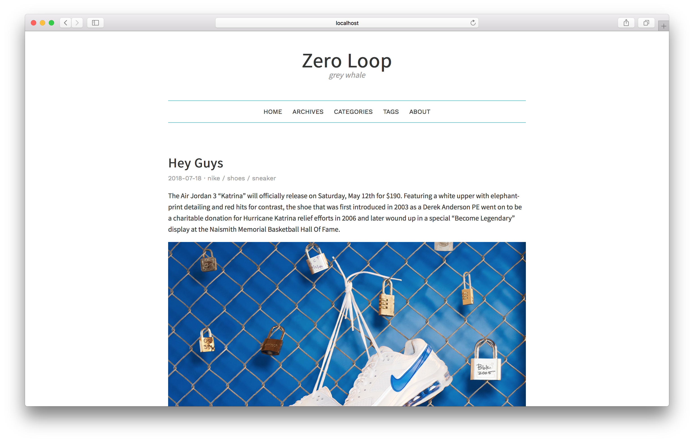

# hexo-theme-cicada

💭 Cicada is a concise and retro theme for Hexo.

## Preview



## Instllation

First change dir to hexo root directory, just like:

```
hexo
  - node_modules
  - public
  - scaffolds
  - source
  - themes
  - package.json
  - _config.yml
```

Then run:

``` bash
npm install --save hexo-renderer-scss
git clone https://github.com/Kexin-Li/hexo-theme-cicada themes/cicada
```

Finally set theme in hexo root `_config.yml` file:

``` bash
# Extensions
## Plugins: https://hexo.io/plugins/
## Themes: https://hexo.io/themes/
theme: cicada
```

## Features

Cicada includes comment, social links, code highlight, tag page, categories page, portfolio page, about page and etc.

You can edit `cicada/_config.yml` file to config those feature.

### Comment

Cicada support disqus comment system. If you do not have an account yet, sign up from [disqus](https://disqus.com).

If you alreay have an account, set up your short name.

``` bash
disqus_shortname:
```

### Social Links

``` bash
social:
  email:
  instagram:
  douban:
  linkedin:
  weibo:
  stackoverflow:
  facebook:
  twitter:
  github:
  rss:
  google:
  zhihu:
  pocket:
```

### Show Tags or Categories

You can choose whether to show tags or categories in an article.

``` bash
show_tag: true/false
show_category: true/false
```

### Article Cover

You can add an image for every article. Config this in each post's meta cover attribute. posts in your `source` folder.

``` yml
---
title:
date:
tags:
cover: /assets/cover.jpg
---

Hello World. balabala...
```

### Tags, Categories, About Page

To add those page, run command in hexo root directory.

``` bash
hexo new page tags categories about
```

Then config Cicada's `_config.yml`:

``` bash
#======================
#       Menu        
#======================
menu:
  home: /
  archives: /archives
  portfolio: /portfolio
  about: /about
  categories: /categories
  tags: /tags
```

### Portfolio Page(Beta)

To add this page, except run command, you also should edit my code. I know it's a very bad way, but I haven't find a better way yet.

`Add a Screenshot(TO-DO)`

So, first run this command in your hexo root directory.

``` bash
hexo new page portfolio
```

then, in your `source/portfolio` directory, open `index.md`, set layout to `portfolio`, and you can add your project cover image.

``` yml
---
title: portfolio
date: 2018-08-26 20:29:16
layout: portfolio
covers:
  - /assets/cicada.jpg
  - /assets/catus.jpg
---
```

Now, open Cicada's source code, edit `themes/cicada/layout/portfolio.ejs`, you can change every class named `content` div and every class named `bottom` div.

``` ejs
<div class="card-wrapper">
  <div class="card">
    <div class="img" style="background-image: url(<%- url_for(page.covers[0]) %>)"></div>
    <div class="content">
      YOUR PROJECT ONE
      <hr>
      <div class="bottom"><a href="LINK FOR PROJECT ONE">Try it</a></div>
    </div>
  </div>
  <div class="card">
    <div class="img" style="background-image: url(<%- url_for(page.covers[1]) %>)"></div>
    <div class="content">
      YOUR PROJECT TWO
      <hr>
      <div class="bottom"><a href="LINK FOR PROJECT TWO">Try it</a></div>
    </div>
  </div>
</div>
```

### Portfolio Page And About Page's SubTitle

``` bash
#======================
#      Portfolio        
#======================
portfolio:
  subtitle: Some Works

#======================
#      About        
#======================
about:
  subtitle: About Me
```

### Others

Cicada also support fancybox, google analytics.

``` bash
fancybox: true
google_analytics:
```

## Development