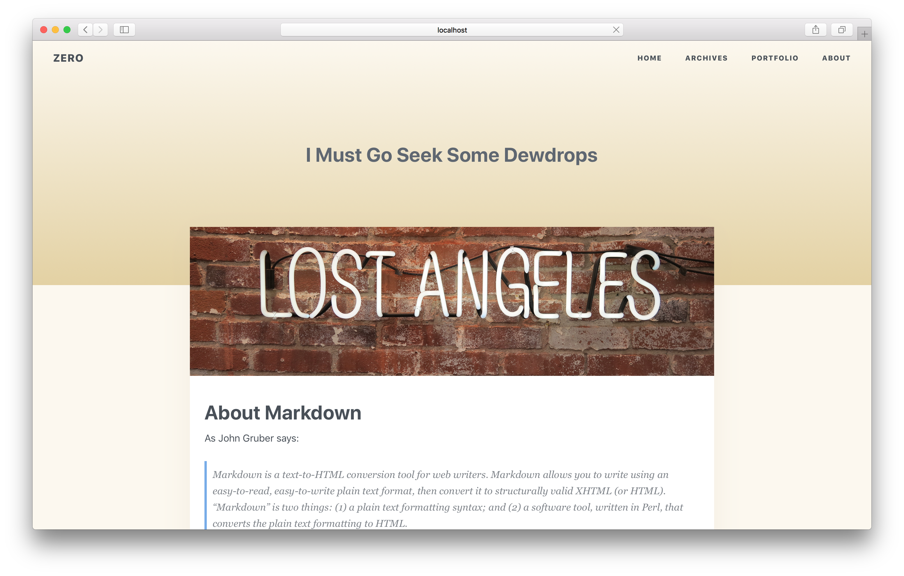

# hexo-theme-cicada

💭 Cicada is a concise and retro theme for Hexo.

English Version | [简体中文](./README_CN.md)

## Preview



## Instllation

Change dir to hexo root directory and run command:

``` bash
npm install --save hexo-renderer-scss
git clone https://github.com/Kexin-Li/hexo-theme-cicada themes/cicada
```

Finally set theme in hexo root `_config.yml` file:

``` bash
# Extensions
## Plugins: https://hexo.io/plugins/
## Themes: https://hexo.io/themes/
theme: cicada
```

## Features

- Responsive layout
- Fancybox supported
- Code highlight
- Portfilo page

Read [Document](https://github.com/Kexin-Li/hexo-theme-cicada/wiki) for more config information.

## Development

- Hexo 3.7
- Scss
- EJS

## License

MIT